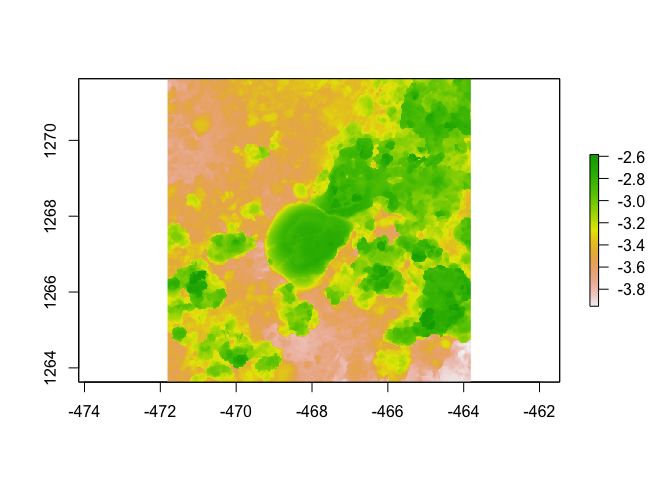

Assignment
================
Jasmine Reighard
2023-08-21

``` r
library(raster)
```

    ## Loading required package: sp

    ## The legacy packages maptools, rgdal, and rgeos, underpinning the sp package,
    ## which was just loaded, will retire in October 2023.
    ## Please refer to R-spatial evolution reports for details, especially
    ## https://r-spatial.org/r/2023/05/15/evolution4.html.
    ## It may be desirable to make the sf package available;
    ## package maintainers should consider adding sf to Suggests:.
    ## The sp package is now running under evolution status 2
    ##      (status 2 uses the sf package in place of rgdal)

``` r
library(habtools)
```

    ## 
    ## Attaching package: 'habtools'

    ## The following object is masked from 'package:raster':
    ## 
    ##     extent

``` r
library(ggplot2)
library(dplyr)
```

    ## 
    ## Attaching package: 'dplyr'

    ## The following objects are masked from 'package:raster':
    ## 
    ##     intersect, select, union

    ## The following objects are masked from 'package:stats':
    ## 
    ##     filter, lag

    ## The following objects are masked from 'package:base':
    ## 
    ##     intersect, setdiff, setequal, union

``` r
library(fishualize)

plot(horseshoe)
```

    ## Warning in sp::CRS(...): sf required for evolution_status==2L

    ## Warning in sp::CRS(...): sf required for evolution_status==2L

<!-- --> \## About
me

### Current lab

Johansen Fish Resillience Lab

### Project focus

The effects of sedimentation on herbivorous reef fish

### Why you chose this course

I wanted to broaden my technical skills and stay relevant with my coding
knowledge

### What do you want to learn about the most in this course

I am pretty unfamiliar with what technologies we will be learning, so
I’m just excited to become familiar with new software and maybe apply it
to my graduate research!

### Your R experience

Intermediate. I’ve taken two courses in R for statistics so my codebank
is pretty basic but useful.

### Fun fact

I fell in love with Pacific spiny lumpsuckers this summer at Friday
Harbor Laboratories. I really want to have an emotional support tank of
them at home or HIMB. (Side note: They can only survive in cold water
environments so there isn’t really a chance for them to become an
invasive species if for some reason they got loose.)
